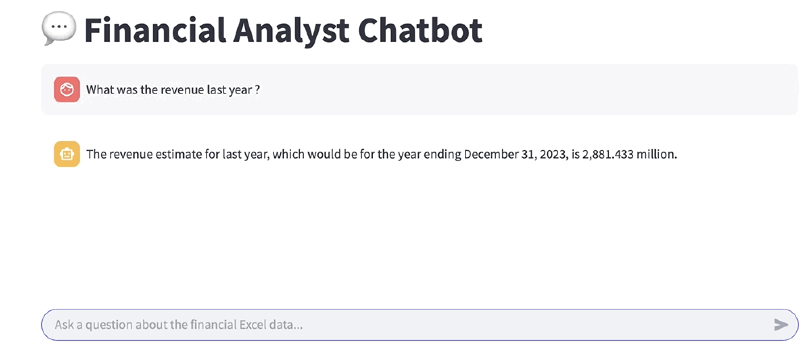
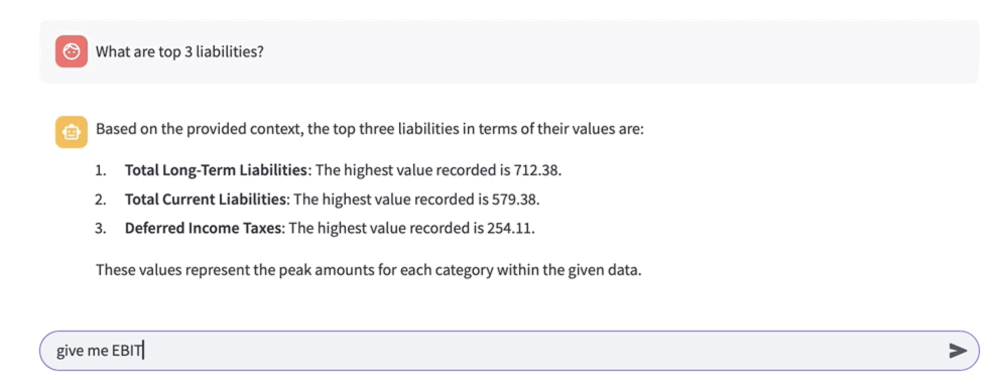
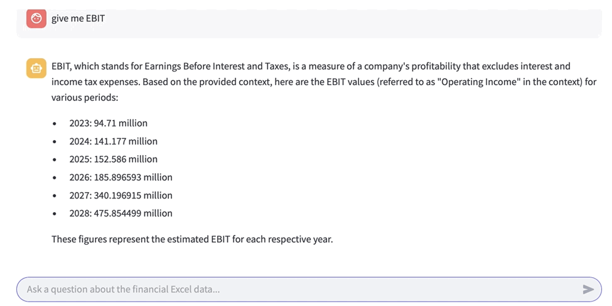
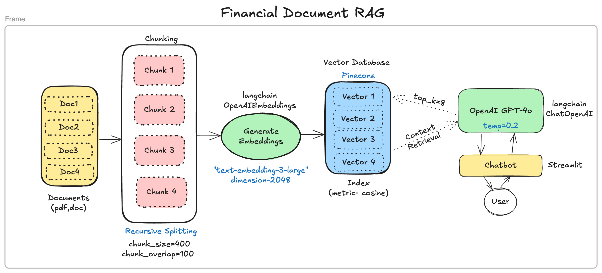
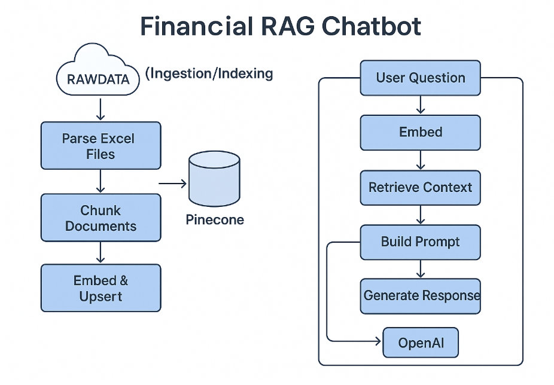

# Financial Analyst RAG Chatbot

Financial Analyst Chabot is a RAG based solution that allows the user to ask questions based on financial documents (excel in this case). It provides a web based UI (Streamlit) for user interaction and uses OpenAI to generate embeddings and responses. PineCone is used to store and search vector embeddings. 


## Features
* Upload & parse excel spreadsheets
* Smart document chunking for optimal retrieval
* Created embeddings using OpenAI's `text_embedding-3-large`
* Vector store and similarity search using PineCone
* Chatbot interface built using Streamlit

## See the demo below


### Query 1 "What was the revenue last year?"



### Query 2 "What are the top 3 liabilities?"


### Query 3 "give me EBIT"


## Tech Stack

* Embeddings - Open AI `text-embedding-3-large'
* LLM - Open AI `gpt-4o` 
* Vector Store - Pinecone
* UI - Streamlit
* File Parsing - pandas + OpenPyXL
* Chunking - LangChain

## Flow 

First the documents are ingested using a parser and cunks are created using `RecursiveCharacterTextSplitter` from Langchain. Then using OpenAIEmbeddings `text-embeddings-3-large` embeddings are created and stored in the **Pinecone** vector database. When a user asks a questions, chatbot create query embeddings and retrieves for similar documents using **cosine similarity**. **Top_k** is set to 8 and OpenAI GPT **temperature** is set to 0.2 to control the randomness & get realiable answers as we're dealing with financial documents.  





## 📁 Project Structure

```
financial-rag-chatbot/
│
├── data/RAWDATA/               # Raw Excel files
├── src/
│   ├── ingestion/              # File parsing, chunking
│   ├── embeddings/             # Embedding generation
│   ├── vector_store/           # Pinecone connection and upsert
│   ├── chat/                   # RAG: retriever, prompt, LLM
│   ├── ui/                     # Streamlit chatbot
│   └── utils/                  # Config loader, token counter
├── config.yaml                 # API keys and config
├── requirements.txt            # Dependencies
├── main.py                     # Indexing pipeline
├── README.md                   # Documentation
```

## Setup Instructions
### 1. Clone the repo

```
git clone https://github.com/prashantcodelab/financial-rag-chatbot.git
cd financial-rag-chatbot
```
### 2. Create a virtual environment and install dependencies
```
python -m venv venv
source venv/bin/activate
pip install -r requirements.txt
```

### 3. Configure your API keys in config.yaml
```
open_ai: sk-<your-openai-key>
pinecone: <your-pinecone-api-key>
pinecone_index: financial-rag-index
```

### 4. Ingest and Index Excel File
* Sample excel file is provided. You can use your own excel file and keep it in data/RAWDATA/
```
python main.py
```
This step will parse and chunk excel, embed the content and add vectore to Pinecone

### 5. Launch the Chatbot
```
streamlit run src/ui/streamlit_app.py
```
You can ask questions based on your excel file - "What is the total expense ?", "What are the top 5 vendors by payment amount?"

## Future Updates
* PDF & CSV support
* Allow file upload directly from chatbot UI
* Role-based chat access
* Latency improvements - Caching

## Additional details about Ingestion and Chatbot
### Ingestion - main.py
`python main.py` <br>

* **main.py** - Runs the document ingestion pipeline. After first run, run only when new files are added.
    - Loads config -> config_loader.py
    - Parses file -> file_parser.py
    - Document chunking -> chunking.py
    - Embed chunks -> embedder.py
    - PineCone -> pinecone_client.py
    - Upserts vectors to Pinecone

```
main.py
├──→ config_loader.py      # loads API keys
├──→ file_parser.py        # reads Excel files
├──→ chunking.py           # splits into text chunks
├──→ embedder.py           # embeds chunks into vectors
└──→ pinecone_client.py    # connects and upserts to Pinecone
```
### Chatbot - streamlit_app.py
`streamlit run src/ui/streamlit_app.py`

* **streamlist_app.py** - Chatbot
    - Loads config - config_loader.py
    - Pinecone - pinecone_client.py
    - Query embedding - embedder.py
    - Retrieves context - context_retriever.py
    - Builds prompt - prompt_builder.py
    - LLM invocation - llm_interface.py
    - Responses in chatbot UI

```
streamlit_app.py
├──→ config_loader.py         # loads API keys
├──→ pinecone_client.py       # connects to Pinecone
├──→ embedder.py              # embeds the user's query
├──→ context_retriever.py     # finds top-k matching chunks
├──→ prompt_builder.py        # builds final LLM prompt
└──→ llm_interface.py         # gets response from OpenAI

```

### Source for Samnple Data File - https://www.nasdaq.com/market-activity/stocks/saia/sec-filings